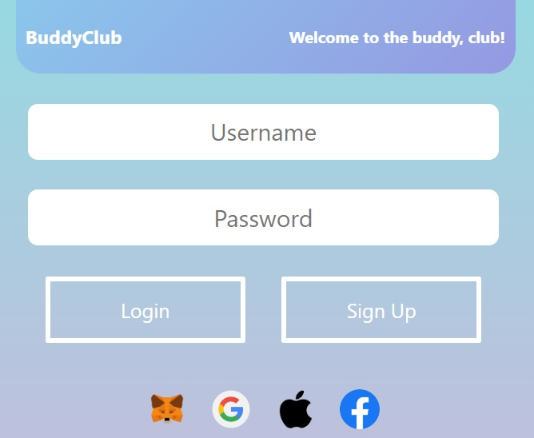
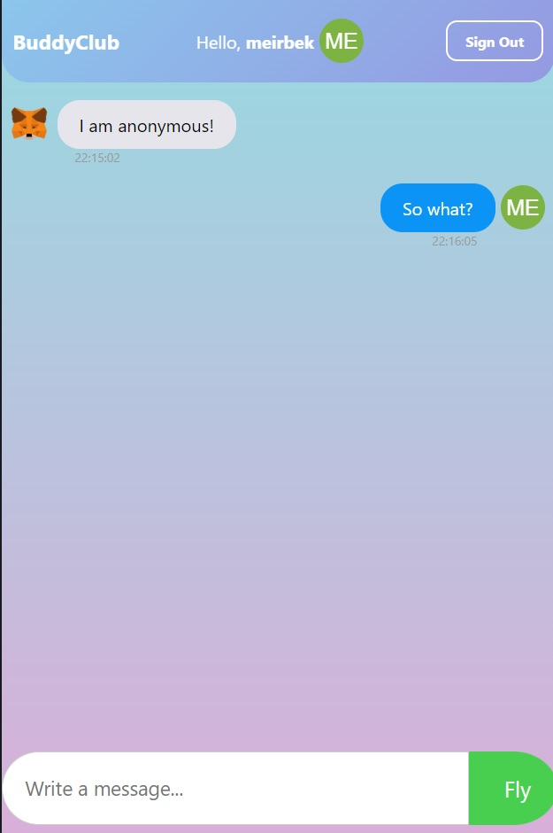

# dMessenger
Decentralized Messenger Web3 App

This is how the project looks like:

## Instructions on how to run the project:

1) Download myapp.rar and extract it

2) Make sure you have installed node js

3) Install the following dependencies using `npm install ...`

  - gun
  - svelte

Run the project using `npm run dev`
